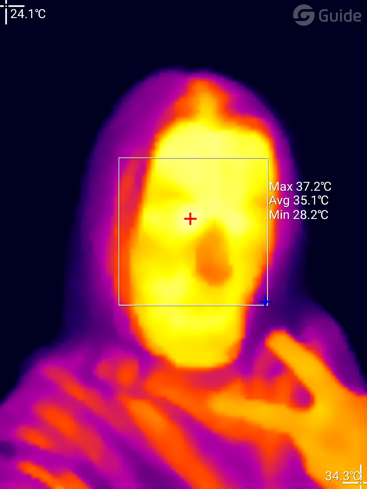
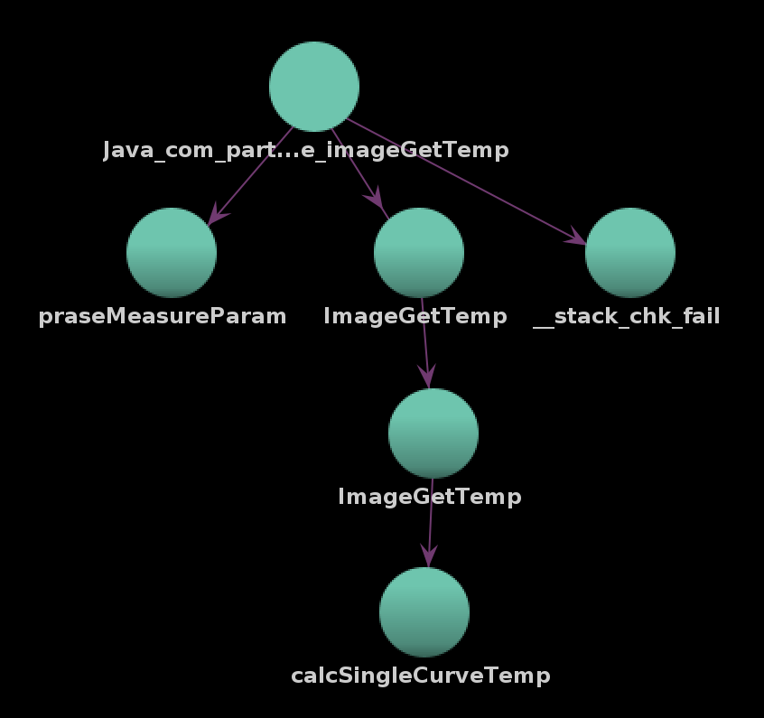

# How to calculating the temperature

So for thermal cameras this is a bit of a pain. Cameras that operate in the spectrum
of visible light seldom have the requirement that the data must be interpreted
physically correct in order to have useful information. In contrast thermal cameras 
return kinda the amount of photons that hit the microbolometer together with a bunch
of other data and leave the temperature calculation to the client.

So here I am trying to understand what the MobiR Air camera expects you to do in
order to get a usable thermal information out of it.


## Calculating temperatures using MobiR images

Before testing anything on camera live I decided to first understand how the SDK
calculates temperatures using a still image I took.



Of course the first thing to look into was how the MobiR Air app does this. Without
searching for too long I found a ominous looking JNI function called `imageGetTemp`
with the following arguments:

```java
// argument names have been discovered along the way, might not be the correct name
native float imageGetTemp(
  @NotNull short[] mJwbTabArr, int mJwbTabLen, 
  @NotNull short[] mCurrCurveArr, @NotNull short[] mNearCurveArr, 
  int curveArrLen, short rawTemp, @NotNull MeasureParam mMeasureParam
);
```

Of course that meant that discovering how the transformation works wasn't as easy as
looking at some decompiled java byte code, but I would instead need to dive into
the gruesome darkness of assembly language and decompiled C++ code and boy I was not
left disappointed.

The JNI interface is hidden in the `libNativeCore.so` lib that is shipped with the
app. Lucky for me the binary wasn't stripped and I always worked with the original
function and struct names. This was a big help in getting a bit of context of what
each method does.

Looking at the call graph of `imageGetTemp` in the so we get the following with two
very interestingly named functions



After gathering enough information about these two functions by finding the names of
most `MeasureParam` parameters, learning about multiply and shift integer division
because __what the hell compilers__?? and too much time at my hand - I got a basic 
understanding how MobiR does their temperature conversions. But I was left with a 
problem: How do I get all these parameters or even the raw image from my JPEG?

```c
// multiply and shift integer division examples

/* curveIdx = realTimeTs / 10 + 200 */
lVar3 = (long)mMeasureParam->realTimeTs * 0x66666667;
curveIdx = (int)(short)(((short)(uint)((ulong)lVar3 >> 0x22) - (short)(lVar3 >> 0x3f)) + 200);
                    

/* boils down to lVar3 = (cRaw * k1) / 3 */
lVar3 = SUB168(SEXT816(cRaw * mMeasureParam->k1) * SEXT816(-0x55e63b88c230e77f) >> 0x40,0);
```


### JPEG and too many APPs

My first intuition was to look into the exif metadata of the MobiR image using exiftool.
Storing the data as some binary blob somewhere in the JPEG header seems to be a common
practice and yeah I was right - at least kind of. Turns out that the additional data
isn't stored as some unknown exif tag, but instead in so called additional APP
segments. As it turns out a JPEG header can contain multiple APP segments. The first
one is mostly commonly used for the exif data. But you can store any byte sequence in
them. And that is what MobiR does. The `imageManager::treatSection` function gives us
a mapping of how they use these APPs:

- `APP2`: param data
- `APP3`: curve data
- `APP4`: Y16 data (raw thermal data as `uint16`)
- `APP5`: VL Mark data
- `APP6`: audio data
- `APP7`: analyzer data
- `APP8`: doodles data
- `APP9`: custom data

Only relevant for us is APP2, APP3 and APP4. I'm also using APP7 in order to be
able to check whether I'm able to correctly convert the temperatures. It contains
the analysis points/rectangles/… together with their min, max and average
temperatures, so it was pretty easy to build an automatic tester.

I'll not go into detail here how these are structured, if you're interested you can
look into the structs in the `./types` folder. What helped a lot here were all the
points where a Java <-> Native conversion of "data" classes happened. Java class
variables seem to be accessed through a reflection API from native code, revealing 
quite a lot about the structs they are converted to and from.


### Putting it all together

After gathering all that I could finally build a conversion in Python and to my
astonishment it worked quite well very fast. I've implemented automatic checks
against the analysis elements that one can add in the app as mentioned above and that
is what I got (all values in Kelvin):
```
$ python3 ./to-temperature.py img/IMG_20221021_201130_v3.jpg
INFO:imgparser:Opening image
Point (P1): Δt=0.05
Point (P2): Δt=0.09
Rect (R1): Δmin=0.04 | Δmax=0.06 | Δavg=0.02
Point (P3): Δt=0.00
Rect (R2): Δmin=0.05 | Δmax=0.06 | Δavg=0.02
```

Interestingly the Java code subtracts a certain `avgB` from every raw temperature
value before it is handed over to the JNI and further conversion happens. `avgB`
seems to be derived from the measured data when the shutter is down.


## Getting temperature in real time

### The setup process

Previously I looked into the RPC interface in order to understand how to interact
with the camera. In this section I wanna give those commands a meaning outside of
the simple memory access and instead name their place in the whole "raw data ->
temperature" process.

The information in this section has been scrapped together by looking into the
decompiled MobiR Air app and its corresponding libraries.

> Note: I'll use a simplified way to describe the commands that are exchanged using 
> `NameOfCommand(ARG1, ARG2, ARG3)`. All arguments should be concatenated and
> converted to little endian on an actual call.


### `JwTabNum` - `GetArmData(0x01e8, 0, 2)` 
Returns the `JwTabNum`. In my case the value is 3. 
This value is respectively used to retrieve the curve data and k array.

### `allCurveData` - `GetArmData(0x1ce, 0, length)
where length is `JwTabNum * 1700 * 2 = 10200`. I'm unsure where the 1700 constant  comes 
from but it seems to be hard coded in the code whenever these tables come up.

The curve is used in `getTwoCurveAndJwbShortArray`. It consists of 1700 byte long
segments. For easier access I'll use `allCurveSegments[n]` to access the data
`allCurveData[n * 1700:(n+1) * 1700]`.

### `jwTab` - `GetArmData(0x1e7, 0, JwTabNum * 2)
Returns 6 bytes.

This data is used in `getTwoCurveAndJwbShortArray`.

### `getTwoCurveAndJwbShortArray`
This returns an array of size `JwTabNum + 3400` where the array contains the
following data

```
0000: allCurveSegments[mCurrChangeRIndex]  # 1700 bytes
1700: allCurveSegments[max(mCurrChangeRIndex - 1, 0)]  # 1700 bytes
3400: jwTab  # JwTabNum bytes
```

## Header

Okay so I've something interesting about the header and especially how to parse it.
In `RawEngine.handleFrame` there's a call to `ParamLineParser.parse`. Both of them
describe pretty clearly what each byte in each frame means. Especially the header is
interesting as every frame is preceded by a bunch of bytes.

```
rawWidth = 120  ?? why is this hardcoded isn't there a 256x1?? camera?
rawHeight = 92
rawHeadWidth = rawWidth
rawHeadHeight = 1
pixelRawSize = 2

headData[rawHeadWidth * rawHeadHeight] as short[]
rawContent[rawWidth * rawHeight] as short[]

rawData[len(headData) + len(rawContent)] as short[]

headData = rawData[0:len(headData)] 
rawContent = rawData[len(headData):][0:len(rawContent)]
```


### Header structure

Deriving from `ParamLineParser.parseFixedParamLine` and
`ParamLineParser.parseCustomParamLine` the header is structured as follows

```
We work in bytes here. Notations like ADR[A:B] mean that at address ADR we only parse
the bits [A;B). Bytes are parsed as little endian.

00: 55 aa !important

fixed param line:
  02: USB Device Version (e.g. 39)
  04: video width  (e.g. 120)
  06: video height (e.g. 92)
  08: Device Name (ASCII)

  ## if 08 doesn't contain parsable bytes - end here
  10: startup shutter temp (e.g. 9800)
  12: realtime shutter temp (e.g. 9762)
  14: realtime len[se] temp (e.g. 9656)
  16: realtime fpa temp (e.g. 17165)
  18: shutter flag 
  1a: closed loop flag
  1c: save flag
  1e: config index
  20: config saved index
  22: int (e.g. 60) ?
  24: res low (e.g. 1000)  ? resolution
  26: res high (e.g. 16383)  ? resolution
  28: gfid low (e.g. 2000) ?
  2a: gfid high (e.g. 1400)
  2c: nuc low (e.g. 4300)
  2e: nuc high (e.g. 4800)


detector reg data array (24 bytes)
  - registers are enumarated with `reg addr 10h-1Bh`
  40[0:1]: size B
  40[1:2]: size A
  40[2:3]: up row
  40[3:4]: up col
  40[4:7]: gain
  40[7:8]: sram sel
  42: x min
  44: x max
  46: y min
  48: y max
  4a[0:2]: pwctl
  4a[2:4]: pwctl col
  4a[4:6]: pwctl adc
  4a[6:8]: tw sel
  4c[0:4]: res sel
  4c[4:8]: vdac trm
  4e[4:8]: V Gfid
  4e[0:4]: I dac
  50[0:2]: I dac V bias
  50[2:4]: Cal N
  50[4:5]: Adc En
  50[5:6]: Bias Mode
  50[6:7]: cal en
  50[7:8]: A out sel
  52[0:1]: adc reset
  52[1:2]: standby
  52[2:3]: set test
  52[3:4]: Ref Sel
  52[4:7]: Dv Sel
  54[0:3]: Dft Sel
  54[4:6]: Rv Sel
  54[6:8]: Mc Delay
  56[4:6]: P Comp


custom param line
  60: temp range (e.g. 0)
  62: -
  63: custom param init
  64: humidity
  65: emission
  66[0:6]: distance
  66[6:16]: env temp
  68: brightness
  69: contrast
  6a[0:4]: palette index
  6a[4:8]: hz
  6b: -
  6c[0:1]: auto timing shutter
  6c[1:2]: cursor status
  6e: timing shutter time
  70: -

  80: fpa temp threshold 1
  82: fpa temp threshold 2
  84: shutter fpa temp delta (if 100 < v < 200 else 150)
  --: shutterWithoutNucFPATempDelta = 30

  90: Ks
  92: K0
  94: K1
  96: K2
  98: K3
  9a: K4
  9c: K5
  9e: B
  a0: Kf
  a2: Tref
```


