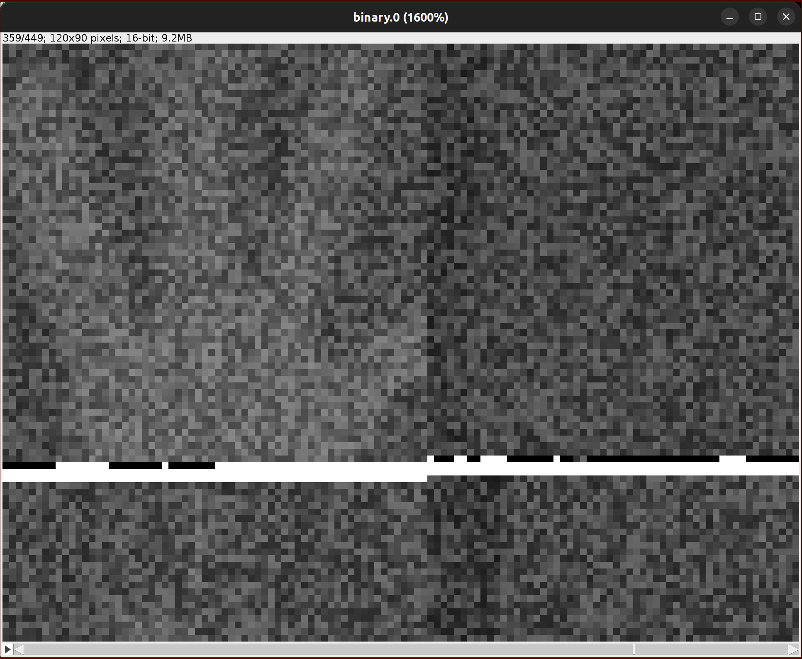

# Reverse engineering MobiR Air Thermal Camera

This is mostly a protocol discussion in order to get the camera up and running on all
kinds of devices instead of only having an Android / iOS driver for it.

## Capturing the USB traffic

### Android emulator
This would be one of the simpler solutions. Starting the MobiR Air app in the android
emulator, passing the USB to it and than capturing the USB traffic from the host
machine using e.g. `usbmon`.

The thermal camera has the same id as the Netchip Tech. "Gadget Zero". As such
testusb is very hot on linking the device to it.


#### 1. changing udev rules
Make the device r/w for common user.
```udev
SUBSYSTEM=="usb", ATTRS{idVendor}=="0525", ATTRS{idProduct}=="a4a0", ATTRS{manufacturer}=="Wuhan Guide Infrared Co., Ltd." MODE:="0666", OWNER:="1000"
```

#### 2. mounting device in emulator
The Android emulator is just a modified qemu and exposes the qemu commands using
`-qemu`. As such passing a usb device through to the guest is almost trivial.
```
./emulator @DEVICE_NAME -qemu -usb -device usb-host,bus=usb-bus.0,vendorid=0x0525,productid=0xa4a0
```

- using `bus=usb-bus.0` in order to use the OHCI controller as the EHCI controller
  doesn't trivally support USB1.1 devices. The XHCI controller does, but it isn't
  guaranteed to be included in the kernel of USB supporting emulator images

As it turns out: the google provided android images do support USB, but only the EHCI
variant. I was able to successfully pass through an USB 2.0 USB stick and it was
recognized by the kernel. But the kernel kept quiet when I tried to pass the USB1.1
thermal camera to it. TL;DR is that I'll need to build my own kernel...

#### 2.1 building my own kernel
It was frustrating at first but I think I was actually quite lucky. Building the
android kernel has become relatively easy in the past years as Google nowadays provides 
an almost ready-to-run compile script. 

I followed the steps outlined [in the XDA forum](https://forum.xda-developers.com/t/guide-build-mod-update-kernel-ranchu-goldfish-5-4-5-10-gki-ramdisk-img-modules-rootavd-android-11-r-12-s-avd-google-play-store-api.4220697/).
But it was a bit frustrating. I didn't rebuild the ramdisk and just tried to boot
with the new kernel, which didn't show any kernel log. I was almost sure that the
kernel didn't boot at all until I used the `rootAVD` script from the XDA post above
to rebuild the ramdisk and Android booted without a problem - except my console was
still lacking the kernel serial output.

I was really lucky that the custom kernel worked (almost) first-try, pushing me into
the right direction: The kernel wasn't compiled with serial log output enabled...
(don't ask me why this wasn't included in a virtual device only build config).
As it turns out there's a `CONFIG_SERIAL_8250_RUNTIME_UARTS` which is set to 0 by
default. As `-show-kernel` attaches a serial device to the virtual device a number
larger than that was required so that the kernel even had a serial device that it
could write to. I found this by comparing the kernel build config between the original 
google AVD kernel and my own. Luckily the kernel config is put into `/proc/config.gz`
on Android (use `zcat` to extract it) so that was quite easy.

```
#
# Serial drivers
#
CONFIG_SERIAL_EARLYCON=y
CONFIG_SERIAL_8250=y
CONFIG_SERIAL_8250_PNP=y
CONFIG_SERIAL_8250_CONSOLE=y
CONFIG_SERIAL_8250_NR_UARTS=4
CONFIG_SERIAL_8250_RUNTIME_UARTS=4
```

With this changed even my own kernel worked with serial output onto the qemu console.
And by emulating an XHCI usb controller I was finally able to get the kernel to
register the thermal camera. Only step that was left was to allow Android to access
USB devices as described in [this XDA post](https://forum.xda-developers.com/t/guide-build-mod-avd-kernel-android-10-11-12-rootavd-magisk-usb-passthrough-linux-windows-google-play-store-api.4212719/)
in chapter 3.


### 3. capturing and parsing the thermal camera stream
QEMU claims to support capturing usb traffic for mounted devices, but the qemu the
emulator is shipped with complains with `Property '.pcap' not found` when trying to
set a pcap file as described in the qemu docs.

So usbmon with wireshark it is. Interestingly usbmon captures traffic from the
complete USB bus and is not able to capture a single device, offloading the work of
filtering through the data stream to the capturing endpoint.

After tuning Wireshark onto the usbmon interface, starting the emulator and filtering 
for incoming traffic from the camera I got a big blob of raw bits and bytes that are
split into sooo many tiny packages. A single frame from the thermal camera must be at
least 120 * 90 * 2B = 21600B long and the capture shows that these are send in
around 350 64B large blobs.

#### 3.1. The image data stream
It was quite easy with a bit of python script to get all the packages from the USB
device, extract the binary data that isn't USB and dump it into a large binary blob.
But now the real challenge begins - How is this data structured and where are the
images?

After staring far to long at the binary blob with ImageJ - guessing the parameters -
I found the right (basic) data structure to be:



- every frame starts with the bytes `0x55aa2700`
  - afterwards we get the image height and image width (2B each in LE)
- the image depth is (as expected) 2 bytes
- the header is 240 bytes long
- the rest of the frame is 120 * 92 * 2B = 22080B of image data in LE
  - data is a stream of 120 pixel for each row (so the image is rotated by 90°)

See the `./scripts/binary_extractor.py` and `./scripts/image_extractor.py` scripts
for the post-processing work mentioned above.

> *Note*: So far I've no idea what most of the bits in the header mean

An interesting bit is that the raw image is really really noisy. Most of it is stable
noise, but it's still fairly hard to see something. Other sensors like the Lepton 2
by FLIR are able to correct this on chip, one just needs to trigger the calibration
at least once. So to get something useable the next step will be to see how the
calibration is activated and retrieve the noise pattern from there.


#### 3.2. calibration
Calibrating this thing is a bit more complicated than expected. The heaviest lifting 
seems to be done by `NonUniformityCorrection::NUCbyTwoPoint` in the library. A simple
search on NUC reveals that this is a standard way of doing things in thermal cameras.
FLIR even has a small page explaining the idea[^1].


##### 3.2.1. `NUCbyTwoPoint`
This function has the following signature:
```cpp
void NonUniformityCorrection::NUCbyTwoPoint(
  NonUniformityCorrection *this,ushort *y16arr,ushort *frame,
  ushort *bArr,ushort *kArr, ushort avgSingleB
)
```

Special note should be given to `bArr` and `kArr`. Both have the same dimension as
a raw image. The former is set during the `updateB` JNI call, which is triggered during 
shutter down. `avgSingleB` is being calculated in the same process. 
`kArr` on the other hand is a bit more complicated. This array stems from the JNI
call `setCurrentK`, which is an array derived from the `mAllKArray`, which in turn is
retrieved using the `GetArmParam` command. This should provide a bit of context.

The method can be summarized into the following two steps:
1. correct raw using `kArr` and `bArr` (⌊ & ⌋ are `math.floor`):
  `∀i: y16arr[i] = ⌊ avgSingleB + (frame[i] - bArr[i]) * kArr[i] / 2¹³ ⌋`

2. call `BadPointCorrectUtils::manualRelpaceBadPoint`
  - replaces defect pixels (`kArr[i] > 0x7fff`) with previous pixels from same row
  - doesn't correct leftmost pixels


##### 3.2.2. Image filters
Additionally to doing a NUC, the library also processes the raw data further using
image filters. The following ones are applied:
1. median image filter
  - blurs image a bit
2. time noise filter
  - not fully sure what it does, but the name already kinda describes it
3. gray spatial filter
  - seems to be an advanced de-noising filter


[1]: https://www.flir.com/discover/professional-tools/what-is-a-non-uniformity-correction-nuc/
